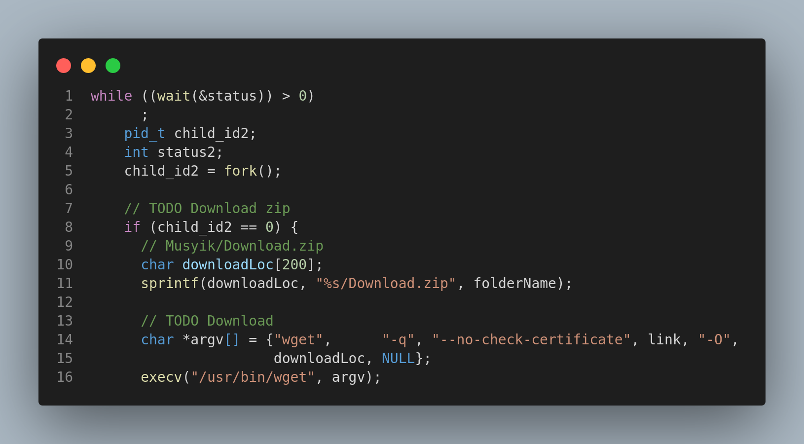
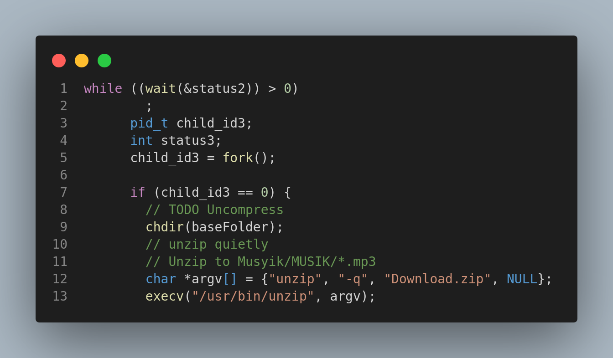
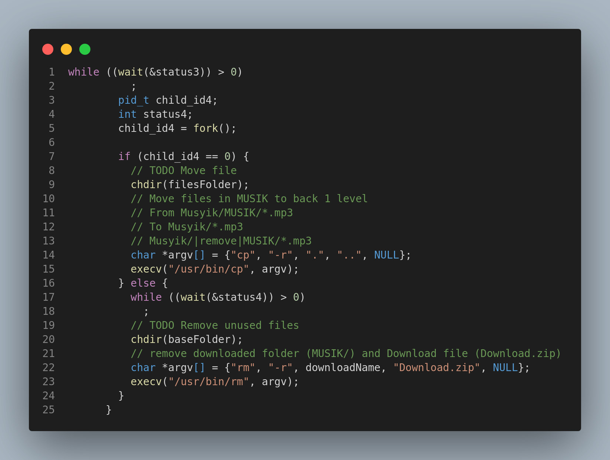
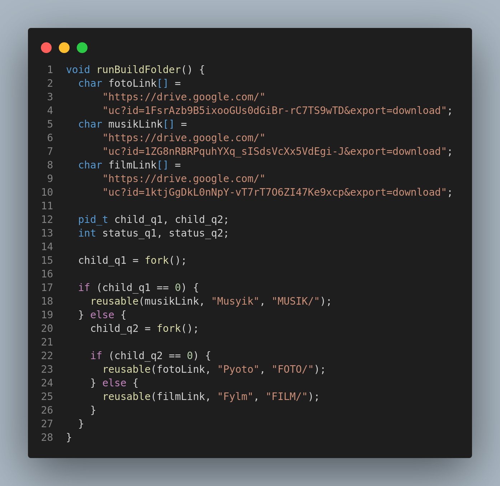

# Soal 1

#### Cara Pengerjaan
Pada soal kali ini kami menggunakan Plate Daemon dengan destinasi program pada `/home/clarence/soal-shift-sisop-modul-2-A08-2021/soal1`
##  Soal 1a

#### Cara Pengerjaan
1. Kami menggunakan fungsi `void reusable(char *link, char *folderName, char *downloadName)` yang bertujuan untuk membuat folder baru.
2. Command `char baseFolder[200] ="/home/clarence/soal-shift-sisop-modul-2-A08-2021/soal1/"` dengan store base folder sementara/temp untuk membuat folder baru pada destinasi tersebut
3. `strcat(baseFolder, folderName)` yaitu untuk melakukan rename atau penamaan folder baru sesuai dengan `foldername` yang sudah dideklrasi pada saat fungsi digunakan `reusable(musikLink, "Musyik", "MUSIK/")` seperti berikut sehingga folder akan berlabel `Musyik`.
4. Command `sprintf(filesFolder, "%s/%s", baseFolder, downloadName)` sebagai sebuah temp memindahkan file download ke folder sesuai dengan `baseFolder, downloadName` seperti `Fylm/FILM` sehingga download file langsung masuk ke folder FILM
5. Dengan menggunakan `child_id` Kami melakukan Command `char *argv[] = {"mkdir", folderName, NULL}` dan `execv("/usr/bin/mkdir", argv)` yaitu membuat folder sesuai dengan inisialisasi fungsi contohnya `Musyik`.

## Soal 1b

#### Cara Pengerjaan
1. Kemudian Kami dengan menggunakan `child_id2` untuk melakukan proses download yaitu `sprintf(downloadLoc, "%s/Download.zip", folderName)` sehingga kita mendownload dengan format `Musyik/Download.zip` lalu meletakkan nya pada foldername `Musyik`.
2. Untuk melakukan download kami menggunakan `char *argv[] = {"wget", "-q", "--no-check-certificate", link, "-O",downloadLoc, NULL}` command `wget -q` untuk mendownload dalam keadaan quiet sehingga tidak terdapat pada log. `Link` yaitu alamat download yang diinisialisasikan saat memanggil fungsi seperti contoh `reusable(musikLink, "Musyik", "MUSIK/")` yaitu memanggil musikLink yang sudah dideklarasi sebelumnya. Lalu melakukan `execv("/usr/bin/wget", argv)`.

## Soal 1c

#### Cara Pengerjaan
1. Sebelum melakukan uncompress kita harus berpindah dengan `chdir(baseFolder)` dimana baseFolder berada seperti di `Musyik` atau folder yang dideklarasi saat memanggil fungsi.
2. Untuk melakukan uncompress kami menggunakan `char *argv[] = {"unzip", "-q", "Download.zip", NULL}` yaitu unzip Download.zip tetapi masih dalam folder `MUSIK`.

## Soal 1d

#### Cara Pengerjaan
1. sebelum memindahkan file tersebut menggunakan `chdir(filesFolder)` untuk pindah ke folder `MUSIK` untuk melakukan proses selanjutnya.
2. Kami menggunakan `char *argv[] = {"cp", "-r", ".", "..", NULL}` dengan `cp` yaitu mengCopy files `.` yaitu semua files pada folder tersebut , yang destinasi nya `..` ke satu folder sebelumnya/parentnya.
3. Karena file tadi masih ada di folder `MUSIK` sehingga kita perlu untuk menghapus folder `MUSIK` beserta isinya dengan `char *argv[] = {"rm", "-r", downloadName, "Download.zip", NULL}`. serta menghapus `Download.zip` yang sebelumnya masih ada.

## Soal 1e

#### Cara Pengerjaan
1. Untuk melakukan semua proses dalam waktu bersamaan kami menggunakan `pid_t child_q1, child_q2` untuk membantu prosesnya multithread. 
2. Dengan `child_q1 = fork()` bertujuan untuk spawn proses pertama. `if (child_q1 == 0) reusable(musikLink, "Musyik", "MUSIK/")` yaitu jika child_q1 = 0 maka proses  akan berjalan.
3. Kemudian `else {child_q2 = fork()` lalu kemudian juga spawn proses kedua dengan variabel child_q2 untuk agar proses berjalan bersamaan. maka `(child_q2 == 0) {reusable(fotoLink, "Pyoto", "FOTO/")` maka proses kedua berjalan juga. dan `else {reusable(filmLink, "Fylm", "FILM/")` proses ketiga juga ikut berjalan pada saat bersamaan.

## Referensi Nomor 2

- save file listing into array https://stackoverflow.com/a/11291863
- Split string with delimiters https://stackoverflow.com/a/9210560

## Referensi Nomor 3

- Get Timestamp http://www.cplusplus.com/reference/ctime/localtime/
- Caesar Cipher https://www.thecrazyprogrammer.com/2016/11/caesar-cipher-c-c-encryption-decryption.html
- argument https://www.geeksforgeeks.org/command-line-arguments-in-c-cpp/
- get epoch time https://stackoverflow.com/questions/11765301/how-do-i-get-the-unix-timestamp-in-c-as-an-int
