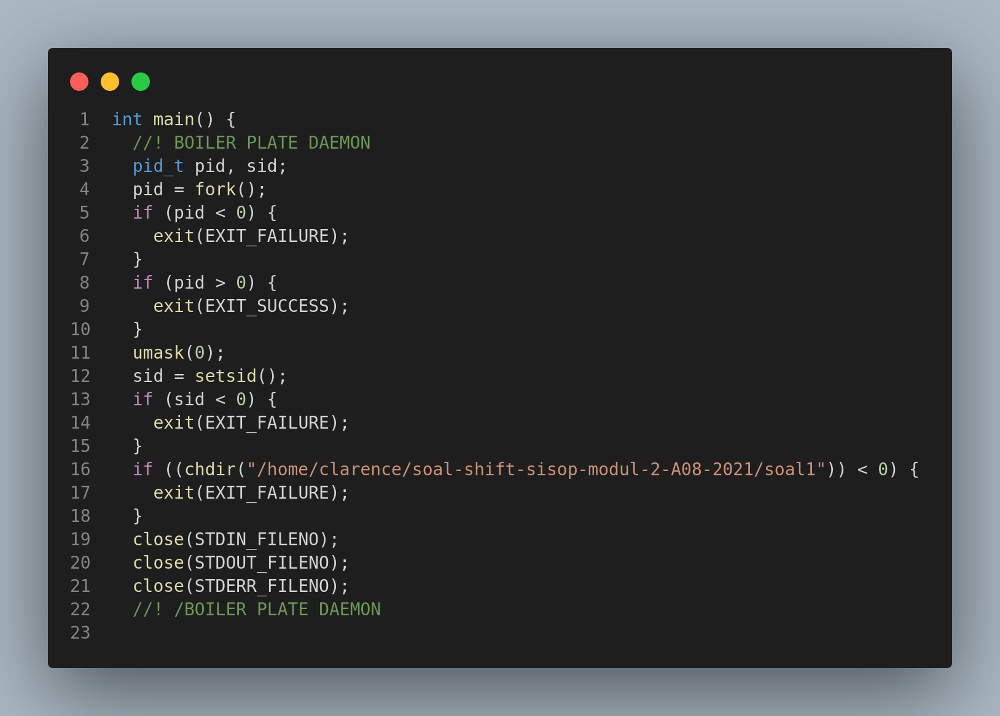
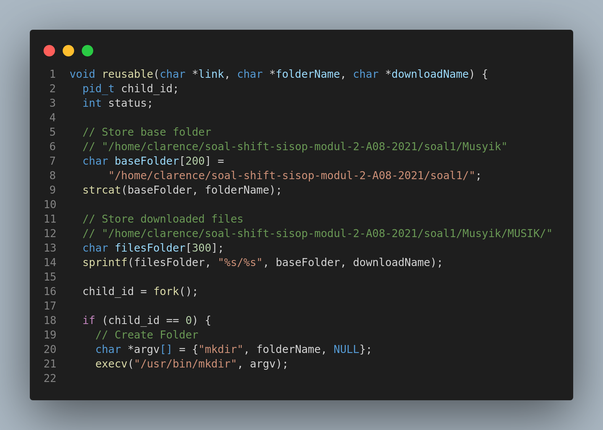

## Soal 1

#### Cara Pengerjaan
Pada soal kali ini kami menggunakan Plate Daemon dengan destinasi program pada `/home/clarence/soal-shift-sisop-modul-2-A08-2021/soal1`
##  Soal 1a

#### Cara Pengerjaan
1. Kami menggunakan fungsi `void reusable(char *link, char *folderName, char *downloadName)` yang bertujuan untuk membuat folder baru.
2. Command `char baseFolder[200] ="/home/clarence/soal-shift-sisop-modul-2-A08-2021/soal1/"` dengan store base folder untuk membuat folder baru pada destinasi tersebut
3. `strcat(baseFolder, folderName)` yaitu untuk melakukan rename atau penamaan folder baru sesuai dengan `foldername` yang sudah dideklrasi pada saat fungsi digunakan `reusable(musikLink, "Musyik", "MUSIK/")` seperti berikut sehingga folder akan berlabel `Musyik`.
4. Command `sprintf(filesFolder, "%s/%s", baseFolder, downloadName)` sebagai sebuah temp memindahkan file download ke folder sesuai dengan `baseFolder, downloadName` seperti `Fylm/FILM` sehingga download file langsung masuk ke folder MUSIK 
#### Kendala

## Referensi Nomor 2

- save file listing into array https://stackoverflow.com/a/11291863
- Split string with delimiters https://stackoverflow.com/a/9210560

## Referensi Nomor 3

- Get Timestamp http://www.cplusplus.com/reference/ctime/localtime/
- Caesar Cipher https://www.thecrazyprogrammer.com/2016/11/caesar-cipher-c-c-encryption-decryption.html
- argument https://www.geeksforgeeks.org/command-line-arguments-in-c-cpp/
- get epoch time https://stackoverflow.com/questions/11765301/how-do-i-get-the-unix-timestamp-in-c-as-an-int
