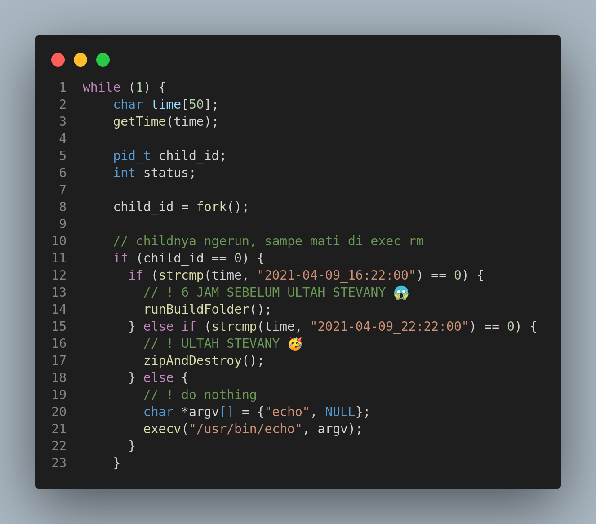
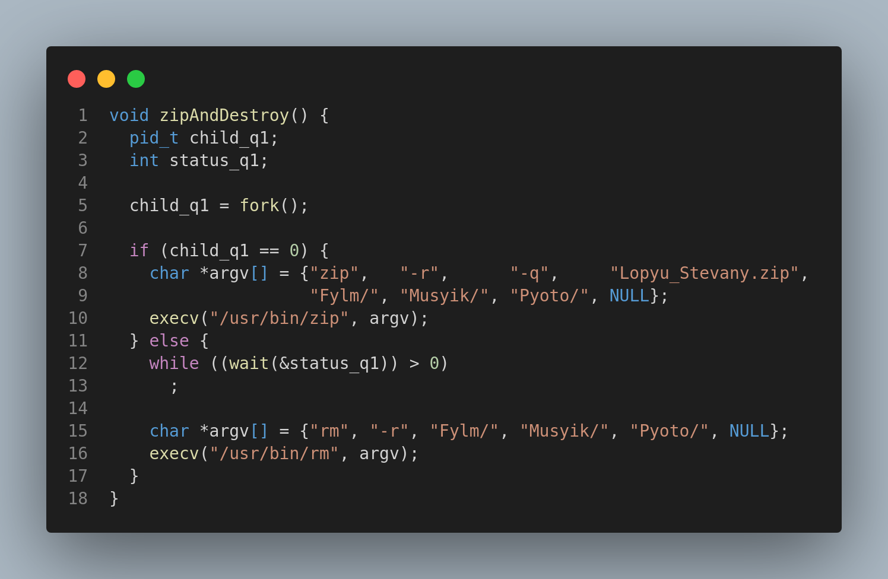

# Soal 1

<!-- .png) -->
#### Cara Pengerjaan
1. Pada soal kali ini kami menggunakan Boiler Plate Daemon dengan destinasi program pada `/home/clarence/soal-shift-sisop-modul-2-A08-2021/soal1`
2. Fungsi `getTime` yaitu untuk mendapatkan timeStamp dengan command `strftime(MY_TIME, sizeof(MY_TIME), "%Y-%m-%d_%H:%M:%S", tmp)` sehingga mendapatkan format tersebut.
##  Soal 1a

#### Cara Pengerjaan
1. Kami menggunakan fungsi `void reusable(char *link, char *folderName, char *downloadName)` yang bertujuan untuk menjalankan semua program dari mendownload sampai memasukkan ke dalam folder yang sesuai.
2. Command `char baseFolder[200] ="/home/clarence/soal-shift-sisop-modul-2-A08-2021/soal1/"` dengan store base folder sementara/temp untuk membuat folder baru pada destinasi tersebut
3. `strcat(baseFolder, folderName)` yaitu nantinya untuk melakukan rename atau penamaan folder baru sesuai dengan `foldername` yang sudah dideklarasi pada saat fungsi digunakan `reusable(musikLink, "Musyik", "MUSIK/")` seperti berikut sehingga folder akan berlabel `Musyik`.
4. Command `sprintf(filesFolder, "%s/%s", baseFolder, downloadName)` sebagai sebuah temp memindahkan file download ke folder sesuai dengan `baseFolder, downloadName` seperti `Fylm/FILM` sehingga download file langsung masuk ke folder FILM
5. Dengan menggunakan `child_id` Kami melakukan Command `char *argv[] = {"mkdir", folderName, NULL}` dan `execv("/usr/bin/mkdir", argv)` yaitu membuat folder sesuai dengan inisialisasi fungsi contohnya `Musyik`.

## Soal 1b

#### Cara Pengerjaan
1. Kemudian Kami dengan menggunakan `child_id2` untuk melakukan proses download yaitu `sprintf(downloadLoc, "%s/Download.zip", folderName)` sehingga kita mendownload dengan format `Musyik/Download.zip` lalu meletakkan nya pada foldername `Musyik`.
2. Untuk melakukan download kami menggunakan `char *argv[] = {"wget", "-q", "--no-check-certificate", link, "-O",downloadLoc, NULL}` command `wget -q` untuk mendownload dalam keadaan quiet sehingga tidak ada log yang terprint. `Link` yaitu alamat download yang diinisialisasikan saat memanggil fungsi seperti contoh `reusable(musikLink, "Musyik", "MUSIK/")` yaitu memanggil musikLink yang sudah dideklarasi sebelumnya. Lalu melakukan eksekusi wgetnya dengan `execv("/usr/bin/wget", argv)`.

## Soal 1c

#### Cara Pengerjaan
1. Sebelum melakukan uncompress kita harus berpindah dengan `chdir(baseFolder)` dimana baseFolder berada seperti di `Musyik` atau folder yang dideklarasi saat memanggil fungsi.
2. Untuk melakukan uncompress kami menggunakan `char *argv[] = {"unzip", "-q", "Download.zip", NULL}` yaitu unzip Download.zip dengan folder bawaan dari hasil download yaitu bernama `MUSIK`.

## Soal 1d

#### Cara Pengerjaan
1. Sebelum memindahkan file tersebut kmai menggunakan `chdir(filesFolder)` untuk pindah ke folder `MUSIK` untuk melakukan proses selanjutnya.
2. Kami menggunakan `char *argv[] = {"cp", "-r", ".", "..", NULL}` dengan `cp` yaitu mengcopy files `.` yaitu semua files pada folder tersebut, ke `..` yaitu ke satu folder sebelumnya/parentnya (`Musyik`).
3. Karena file hanya kita copy, maka file masih ada di folder `MUSIK` sehingga kita perlu menghapus folder `MUSIK` beserta isinya dengan `char *argv[] = {"rm", "-r", downloadName, "Download.zip", NULL}`. serta menghapus `Download.zip` yang sebelumnya masih ada. `-r` ditambahkan untuk menghapus semua folder beserta filenya.

## Soal 1e

#### Cara Pengerjaan
1. Dengan menggunakan fungsi getTime kita dapat melakukan `if (child_id == 0) {if (strcmp(time, "2021-04-09_16:22:00") == 0)` sehingga pada saat 6 jam sebelum ULTAH kita melakukan command `runBuildFolder()` untuk melakukan fungsi proses yang dibutuhkan.

1. Untuk melakukan semua proses dalam waktu bersamaan kami menggunakan `pid_t child_q1, child_q2`.
2. Dengan `child_q1 = fork()` bertujuan untuk spawn proses pertama. `if (child_q1 == 0) reusable(musikLink, "Musyik", "MUSIK/")` yaitu jika merupakan child process maka function reusable akan berjalan.
3. Kemudian `else {child_q2 = fork()` juga spawn proses kedua dengan variabel child_q2 untuk agar proses berjalan bersamaan. maka `(child_q2 == 0) {reusable(fotoLink, "Pyoto", "FOTO/")` maka proses kedua berjalan juga. Terakhir,  `else {reusable(filmLink, "Fylm", "FILM/")` proses ketiga juga ikut berjalan pada saat bersamaan.
4. Ketiga program bisa berjalan secara bersamaan dikarenakan kami tidak menggunakan wait sehingga setiap proses tidak perlu menunggu.

## Soal 1f

#### Cara Pengerjaan
1. Jika sudah memasuki waktu ulang tahun dengan pengecekan menggunakan `else if (strcmp(time,"2021-04-09_22:22:00") == 0) {zipAndDestroy()` yaitu dengan melakukan fungsi `zipAndDestroy`
2. Pada proses ini, kami menggunakan `char *argv[] = {"zip",   "-r",      "-q",     "Lopyu_Stevany.zip","Fylm/", "Musyik/", "Pyoto/", NULL}` yang bertujuan `zip` yaitu untuk melakukan compress atau zip file, `-q` sehingga melakukan fungsi unzip tanpa mengeprint lognya, dan `"Lopyu_Stevany.zip"` yaitu untuk label zip. Dan `"Fylm/", "Musyik/", "Pyoto/"` yaitu adalah folder" yang akan di zip.
3. Untuk menghapus file yang sudah dilakukan compress/zip yaitu dengan `char *argv[] = {"rm", "-r", "Fylm/", "Musyik/", "Pyoto/", NULL}` . Command `rm -r` digunakan untuk menghapus folder beserta file `Fylm/", "Musyik/", "Pyoto/"`. 

# Soal 2
Tujuan dari soal 2 ini adalah melakukan ekstrak pada file zip [pets.zip](https://drive.google.com/file/d/1g5rehatLEkqvuuK_eooHJXB57EfdnxVD/view?usp=sharing) dengan kondisi tertentu. Implementasi dari soal ini, kami membutuhkan beberapa fungsi bantuan, di antaranya sebagai berikut

## Soal 2a
Pada soal 2a kita diminta untuk melakukan ekstrak file zip [pets.zip](https://drive.google.com/file/d/1g5rehatLEkqvuuK_eooHJXB57EfdnxVD/view?usp=sharing) namun yang diminta hanya file `.jpg` dan menghapus yang selainnya. Untuk itu kita melakukan pemanggilan function `unzipAndCleanFiles()` dan `file_list()`
#### unzipAndCleanFiles()

1. Function ini digunakan untuk melakukan ekstraksi. Function dipanggil di dalam child process dengan pemanggilan `child_unzip = fork();`.
2. Di dalam function `unzipAndCleanFiles()` dilakukan pemanggilan child proses `child_mkdir = fork();` untuk membuat folder files (agar lebih rapi saja). Di dalam child proses, dilakukan `execv("/usr/bin/mkdir", argv);` dengan argumen `char *argv[] = {"mkdir", "files", NULL};`.
3. Selanjutnya pada parent proses dilakukan ekstrak `execv("/usr/bin/unzip", argv);` dengan argumen `char *argv[] = {"unzip", "../pets.zip", "*", NULL};`. Sebelum itu dilakukan perpindahan directory dengan `chdir("/home/[user]/soal-shift-sisop-modul-2-A08-2021/soal2/files");`.

#### file_list()

1. Function ini untuk melakukan penyetoran list file ke dalam array sekaligus menghapus semua isi selain file `.png` serta function bertipe data `size_t`. Function kami ambil referensi dari [sini](https://stackoverflow.com/a/11291863).
2. Function menerima argumen berupa directory `files` tadi dan `&files` bertipe `char` double pointer.
3. Pada Function, directory diterima oleh parameter `path` dan dimasukkan ke variabel `dp`. Jika `dp` NULL maka dilakukan pengembalian tidak ada directory. Argument kedua merupakan pointer `files` yang diterima oleh variabel `ls`. Nantinya ls ini sebagai return parameter yang berisi list file pada directory `dp`.
4. Selanjutnya terdapat variable temporary `ep = readdir(dp);` untuk melakukan perhitungan jumlah file pada directory `dp` dengan perulangan `while (NULL != ep)` dengan isi `count++`. Variable `count` nantinya untuk mengalokasikan jumlah memory array `ls` serta sebagai return value.
5. Dilakukan perulangan yang sama kembali dengan nomor 4, namun kali ini untuk mengambil list file. Diberikan conditional `if (!strcmp(ep->d_name, ".") == 0 && !strcmp(ep->d_name, "..") == 0)` untuk menghindari file `.` dan `..` serta conditional lagi `if (strcmp(strrchr(temp, '\0') - 4, ".jpg") == 0` untuk mengambil hanya berekstensi `.jpg`.
6. Pada kondisional kedua tersebut, pada cabang bernilai `True` melakukan penyetoran nama file `(*ls)[count++] = strdup(ep->d_name);`. Untuk cabang `False` melakukan penghapusan file atau folder.
7. Implementasi penghapusan pada nomor 6 adalah menggunakan pemanggilan `child_rmdir = fork();` dengan proses `execv("/usr/bin/rm", {"rm", "-r", filedir, NULL});`.
8. Terakhir dilakukan return value `count` serta didapatkan list file pada `files` yang direturn dari parameter.
#### Hasil

## Soal 2b
Pada Soal 2b diminta untuk melakukan pembuatan folder tiap hewan. 
1. Pertama kita lakukan iterasi dari dari `files` dari 0 hingga `count`. Iterasi dilakukan kepada tiap nilai dari `files` atau tiap `files[i]`. Selanjutnya kita melakukan pengambilan nama hewan pada nama file serta pemisahan hewan yang memiliki 2 nama hewan dalam 1 file. 
2. Untuk pengambilan nama hewan, kita replace nama file 4 charachter terakhir dengan `\0` atau `files[i][strlen(files[i]) - 4] = '\0';`
3. Selanjutnya dilakukan pemisahan str nama file dengan delimiter `_` sehingga didapatkan nama hewan tiap individu yang mana disimpan dalam variabel `individualPets` atauj dengan syntax `dtmsplit(files[i], "_", &individualPets, &countTok);`. `countTok` untuk menghitung jumlah hewan individu setelah dilakukan pemisahan
4. Selanjuta tiap individu hewan dilakukan iterasi untuk diambil tiap nilai nama file dengan delimiter `;` (bila tidak gabungan, diiterasi sekali) atau dengan syntax `d = dtmsplit(temp, ";", &petAtr, &petAtrTok);`.Hasil pemisahan disimpan dalam variable `petAtr`. 
5. Di dalam perulangan yang sama, dilakukan pemanggilan  `child_id_mkdir = fork();`. Pada child process dilakukan pembuatan folder dengan `execv("/usr/bin/mkdir", {"mkdir", "-p", petDir, NULL});` dengan nilai `petDir` adalah hasil dari `sprintf(petDir, "petshop/%s", petAtr[0]);`. `petAtr[0]` adalah data nama hewannya. tanda `-p` pada mkdir untuk membatalkan pembuatan folder bila nama folder sudah ada.

#### Hasil

## Soal 2c
Pada soal 2c diminta untuk memasukkan file `jgp` tersebut ke folder yang sesuai dengan nama hewan.
1. Untuk menyelesaikan permasalahn ini kita melanjutkan perulangan terakhir pada soal 2b. Setelah selesai pembuatan folder pada child process, dilanjutkan pemindahan file pada parent process.
2. Pertama kami melakukan pemanggilan `child_id_cp = fork();` untuk melakukan pemindahan.
3. Pertama dilakukan pemasukan nilai nama file ke variable temporary dengan `strcpy(filesUntouched, files[i]);`. Variable `filesUntouched` dimasukkan ke variable `fromFile` sebagai file asal dengan `sprintf(fromFile, "%s", filesUntouched);`. Adapun variable `toFile` sebagai destinasi file dengan `sprintf(toFile, "../petshop/%s/%s.jpg", petAtr[0], petAtr[1]);`. Kembali lagi, `petAtr[0]` adalah nama jeni hewan dan `petAtr[1]` adalah nama asli hewan tersebut.
4. Terakhir, kita lakukan copy file dengan `execv("/usr/bin/cp", {"cp", fromFile, toFile, NULL});`

#### Hasil

## Soal 2d
Pada soal 2d diminta untuk memisahkan 1 foto yang sama yang memiliki 2 hewan berbeda, namun nama file menyesuaikan pada folder mana dia dimasukkan.
1. Hal ini sudah teratasi karena pada iterasi sebelumnya, yaitu `for (int j = 0; j < countTok; j++)` sudah menghimpun 2 hewan berbeda dalam satu file yang sama.

#### Hasil

## Soal 2e
Pada soal 2e kita diminta untuk membuat file `keterangan.txt` berisi data informasi hewan tiap folder.
1. Untuk menyelesaikannya, kita masih pada iterasi yang sama, setiap iterasi dilakukan pemanggilan function `writeLog(petAtr[0], petAtr[1], petAtr[2]);`.
2. Pada function, pertama melakukan penulisan sesuai format yang diminta, yaitu `sprintf(templatePrint, "nama: %s\numur: %s tahun\n\n", nama, umur);`.
3. Membuka file `FILE *keteranganFile`. 
4. Penulisan directory file `sprintf(keteranganLoc, "petshop/%s/keterangan.txt", category);`
5. Pembukaan file dengan parameter `a` agar dapat ditambahkan di bawahnya bila ada penambahan atau append. Syntaxnya adalah `keteranganFile = fopen(keteranganLoc, "a");`
6. Selanjutnya ditulis dengan `fprintf(keteranganFile, "%s", templatePrint);`
7. Lalu terakhir ditutup dengan `fclose(keteranganFile);`

#### Hasil

## Kendala
Dalam pengerjaan kami menemukan kendala yaitu yang pertama
1. Ketika mengerjakan dan berpindah laptop antar kelompok, kami menemukan error sebagai berikut

Hal ini dikarenakan di ssh, kami menggunakan command execv yaitu `/usr/bin/unzip`, dan ketika codingan di pindah untuk di run di linux ubuntu, terjadi error karena file command unzip berada pada `/bin/unzip`.
2. Kendala kedua adalah ketika menggunakan daemon untuk soal2. Kami menjalankan daemon setiap detik, dan mengabaikan proses ketika belum jamnya. Dan pada proses ketika diexit menggunakan `exit(0)`, muncul defunct sebagai berikut

Hal ini masih belum diketahui kenapa muncul tulisan defunct seperti itu, kami sudah mencoba bertanya ke asisten penguji dan masih belum tahu kenapa demikian. Oleh karena itu kami menyelesaikan problem tersebut dengan alternatif menggunakan execv echo sehingga proses tergantikan dengan proses execv.

# Soal 3
Pada soal 3 kami tetap menggunakan boiler plate dari daemon dengan `chdir=/home/clarence/soal-shift-sisop-modul-2-A08-2021/soal3`
## Soal 3a
1. Tujuan dari soal 3a yaitu untuk membuat sebuah direktori setiap 40 detik dengan memanfaatkan timestamp dengan menggunakan fungsi `getTime` dari soal 1.
2. Program ini melakukan store ke `parentDir` berupa fungsi dari `getTime` untuk mendapatkan timestamp sesaat program berjalan
3. Dengan melakukan fork pada `child_id` kita dapat melakukan spawn proses sehingga kita dapat melakukan proses lain  secara paralel.
4. lalu dengan melakukan fork lagi pada `child_id2` kita melakukan command `"mkdir", "-p", parentDir, NULL` yaitu membuat sebuah direktori dengan `parentDir` yaitu fungsi timestamp sehingga label direktori baru tersebut berupa timestamp saat itu. 

## Soal 3b
1. Dengan `while ((wait(&status2)) > 0)` yaitu setelah proses mkdir selesai kita melakukan proses  Download file dengan  `for (int i = 0; i < 10; i++)` yaitu melakukan download selama 10 kali dengan ` sleep(5)` yaitu jeda selama setiap 5 detik
2. Dalam hal ini yang melakukan jeda hanya child proses `child_3` sehingga proses parent tetap berjalan.
3. Pada proses `child_id3` kita memenggil fungsi `getTime` yang di store pada variabel `imgFile` lalu membuat direktori dengan format `sprintf(namaFile, "%s/%s.jpg", parentDir, imgFile)` yaitu folderUtama/ImgFile.jpg yaitu tetap timestamp/timestamp.jpg dengan melakukan looping setiap 5 detik. sehingga fungsi getTime `imgFile` selalu berubah.
4. `imageSize = time(NULL) % 1000 + 50` ImageSize disini untuk mendapatkan Epoch Unix. lalu melakukan store link download dengan `snprintf(linkDownload, sizeof(linkDownload),"https://picsum.photos/%ld", imageSize)` yaitu melakukan download pada link dengan `%ld` sesuai dengan nilai Epoch Unix.
5. Lalu untuk melakukan download kami melakukan fork `child_id3` yaitu setiap looping proses child tersebut akan melakukan download dengan `wget", "-q", "-O", namaFile, linkDownload, NULL` dan proses tersebut akan mati setelah download setiap 5 detik looping.

## Soal 3c

1. Setelah proses looping download selesai Dengan statusText yang berisi `"Download Success"` tetapi dengan fungsi `cipher` disini digunakan untuk merubah setiap huruf dengan menambah `key = 5` sehingga seperti huruf A menjadi F.
2. Kemudian membuat `status.txt`, lalu dengan `FILE *statusFile = fopen(statustxtFileName, "w")` yaitu `fopen` disini yaitu membuka file status dan `w` dengan melakukan write pada status.txt dengan `fputs(statusText, statusFile)` yaitu mengisi dengan text berupa `Download Success` yang sudah dilakukan fungsi cipher pada statusFile.
3. lalu dengan fork `child_id4` untuk zip folder dengan format `sprintf(outputZip, "%s.zip", parentDir)` yaitu berlabel timestamp pada saat zip. Dan untuk command `"zip", "-r", outputZip, parentDir, NULL` yaitu untuk melakukan zip `-r` disini agar isi file juga ikut di compress. dengan `outputZip` yaitu format sebelumnya. `parentDir` disini adalah folder yang akan dilakukan zip.
4. setelah proses zip selesai. kita harus menghapus file yang sudah dizip dengan command `"rm", "-r", parentDir, NULL` yaitu menghapus semua file tersebut.
5. Tujuan kami melakukan proses pada `else` yaitu agar proses parents tetap berjalan selama proses looping agar `sleep(40)` tepat sesuai yang diinginkan
## Soal 3d

1. Killer proses disini yaitu melakukan terminate proses dengan memanggil proses Killer tersebut. Dalam killer program tersebut terdapat 2 format yaitu `-z` dan `-x`. dan Command `killer = fopen("Killer", "w")` yaitu dengan membuat file killer dengan melakukan write. 
3. pada format `-z` yaitu melakukan terminate parents proses dan semua child proses akan terhenti. sehingga menjadi state terakhir dan semua mati. Variabel `"killList=$(echo $(pidof ./soal3))\n"` yaitu untuk melakukan cek semua file yang pid nya soal3. lalu dengan `"kill -9 $killList\n` yaitu melakukan kill pada proses child yang terdapat pada variabel `killlist`. lalu `rm Killer` untuk menghapus file Killer tersebut.
3. sedangkan pada pada format `-x` hanya melakukan terminate parents saja command `"kill %d\n"` yaitu hanya melakukan kill pada pid parent saja., sehingga proses child tetap berjalan hingga proses zip dan remove file. sehingga hanya menyelesaikan child terakhir yang di respawn.

### Kendala
## Referensi Nomor 2

- save file listing into array https://stackoverflow.com/a/11291863
- Split string with delimiters https://stackoverflow.com/a/9210560

## Referensi Nomor 3

- Get Timestamp http://www.cplusplus.com/reference/ctime/localtime/
- Caesar Cipher https://www.thecrazyprogrammer.com/2016/11/caesar-cipher-c-c-encryption-decryption.html
- argument https://www.geeksforgeeks.org/command-line-arguments-in-c-cpp/
- get epoch time https://stackoverflow.com/questions/11765301/how-do-i-get-the-unix-timestamp-in-c-as-an-int
