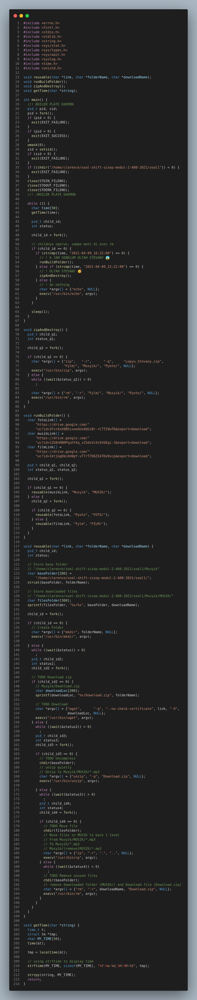

## Soal 1

#### Source Code 1a

#### Cara Pengerjaan

#### Kendala

## Referensi Nomor 2

- save file listing into array https://stackoverflow.com/a/11291863
- Split string with delimiters https://stackoverflow.com/a/9210560

## Referensi Nomor 3

- Get Timestamp http://www.cplusplus.com/reference/ctime/localtime/
- Caesar Cipher https://www.thecrazyprogrammer.com/2016/11/caesar-cipher-c-c-encryption-decryption.html
- argument https://www.geeksforgeeks.org/command-line-arguments-in-c-cpp/
- get epoch time https://stackoverflow.com/questions/11765301/how-do-i-get-the-unix-timestamp-in-c-as-an-int
